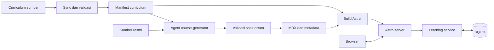
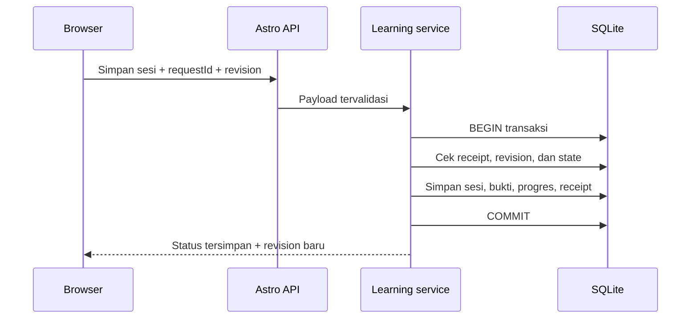

# CS-101 — Engineering design

Draft arsitektur · 6 Oktober 2026 · Mengikuti [product design](design.md)

**V1: satu aplikasi Astro + MDX, SQLite untuk progres, generation lewat agent/CLI.** Target awal satu learner pada satu server dengan disk persisten. Fondasi halaman, konten, dan API sesi sudah diimplementasikan; review engine dan pipeline generation masih menjadi target. Status fitur dan cara menjalankan ada di [README.md](../README.md). Skill `engineering design` belum tersedia, sehingga rancangan disusun langsung dari kontrak course-generator dan product design.

## Gambaran sistem



Ada dua alur: konten disiapkan sebelum release, progres ditulis saat belajar. Membaca lesson tidak memanggil model atau proses generation.

## Komponen dan batas tanggung jawab

| Komponen | Tanggung jawab | Penyimpanan |
| --- | --- | --- |
| Curriculum sync | Normalisasi Task ID, scope, prerequisites, urutan, dan exit criteria | `curriculum/manifest.json` |
| Course generator | Riset dan hasilkan satu lesson sesuai Task ID | Staging MDX + generation metadata |
| Content validator | Periksa schema, coverage, link, dan build | Laporan validasi per generation |
| Astro renderer | Render halaman, navigasi, code block, sumber | Content collection dari release |
| Browser components | Tema, reveal, kuis, form sesi, feedback | Draft sementara; progres resmi melalui API |
| Learning service | Task aktif, evidence, kelulusan, review, idempotensi | SQLite melalui storage adapter |

Astro dan API berjalan dalam satu proses Node. Gunakan TypeScript dan schema bersama untuk data masuk. Interaktivitas sederhana memakai script komponen; framework UI tambahan hanya jika kompleksitas komponen membutuhkannya.

## Kepemilikan data

| Data | Sumber kebenaran | Aturan |
| --- | --- | --- |
| Scope dan acceptance criteria | Curriculum snapshot | Lesson tidak boleh mengubahnya |
| Isi lesson | MDX + metadata generation | Bisa dibuat ulang; terikat fingerprint curriculum |
| Kelulusan dan bukti | SQLite | Tidak berubah ketika lesson dibuat ulang |
| Task aktif | Satu baris learner state | Maksimal satu task aktif |
| Catatan sesi | Riwayat append-only | Koreksi menjadi event baru yang merujuk catatan lama |
| Tema dan draft form | Browser | Bukan bukti progres yang sudah tersimpan |

**SQLite menggantikan usulan JSON/JSONL pada product design.** Dua file terpisah sulit diperbarui sebagai satu transaksi. SQLite memungkinkan sesi, bukti, dan status berubah bersama. JSON/JSONL tetap tersedia sebagai format ekspor. Storage adapter memungkinkan migrasi ke database server jika kebutuhan deployment berubah.

## Model data minimum

| Entitas | Field penting |
| --- | --- |
| Curriculum task | `taskId`, `track`, `phase`, `order`, `prerequisites`, `criteria[]`, `challenge`, `projectRequirements`, `fingerprint` |
| Generation record | `taskId`, `fingerprint`, `sources[]`, `coverage[]`, `generatedAt`, `validatorResult` |
| Learner state | `id=1`, `activeTaskId`, `revision` |
| Task progress | `taskId`, `status`, `passedFingerprint`, `lastAnchor`, `continueFrom`, `revision` |
| Session | `id`, `taskId`, `kind`, `recordedAt`, `fingerprint`, `evidence[]`, `continueFrom`, `minutes?` |
| Review attempt | `id`, `taskId`, `questionSetVersion`, `answers`, `gradingMode`, `score`, `assisted`, `result` |
| Review schedule | `taskId`, `policyVersion`, `step`, `dueAt?` |
| Request receipt | `requestId`, `payloadHash`, `response` |

Criterion ID berasal dari curriculum jika tersedia; jika tidak, sync membuat ID deterministik yang terikat fingerprint. Bukti selalu merujuk pasangan criterion ID + fingerprint. Satu bukti boleh mendukung beberapa kriteria secara eksplisit.

Timestamp disimpan dalam UTC; UI menampilkan zona learner. Evidence V1 berupa teks atau URL, dirender sebagai teks/link aman. Upload file dan eksekusi kode learner belum termasuk V1.

## Alur generation

1. Sync curriculum; tolak Task ID duplikat, prerequisite hilang, atau siklus dependensi.
2. Pilih satu Task ID beserta dependensi langsung dan checkpoint terkait.
3. Agent membaca sumber, membuat lesson spec, MDX, dan metadata di staging.
4. Validator memeriksa schema, coverage tiap exit criterion, sumber, internal link, contoh yang dapat diuji, dan build MDX.
5. Periksa kualitas penjelasan dan kesesuaian assessment; schema yang valid saja belum membuktikan kualitas isi.
6. Setelah lolos, promosikan pasangan MDX + metadata melalui satu perubahan repository. Build release dari snapshot curriculum dan lesson yang sama.
7. Aktifkan build baru hanya setelah build dan smoke check lolos. Build gagal mempertahankan release sebelumnya.

MDX adalah source yang dapat menjalankan kode saat build. Batasi import ke komponen course yang disetujui dan periksa output generator sebelum build. Request browser tidak menerima MDX, menjalankan generator, atau memuat path file bebas.

Perubahan curriculum membuat lesson dengan fingerprint lama berstatus stale. Bukti dan kelulusan historis tetap terlihat dengan versi asal; UI memberi tanda perlu validasi ulang. Kelulusan baru hanya memakai snapshot aktif yang memiliki lesson valid.

## Alur belajar dan API



| Endpoint usulan | Kontrak |
| --- | --- |
| `GET /api/learning` | Task aktif, status, continuation, review due, revision |
| `POST /api/active-task` | Validasi task; ganti task aktif dan simpan draft sesi sebelumnya dalam transaksi yang sama |
| `POST /api/sessions` | Simpan progress atau pengajuan kelulusan beserta bukti |
| `POST /api/reviews` | Simpan attempt, hasil review, dan jadwal berikutnya |
| `GET /api/export` | Ekspor learning state dan riwayat evidence |

Semua mutasi membawa `requestId` dan expected revision. Request identik yang diulang mengembalikan hasil lama; ID sama dengan payload berbeda ditolak. Cek receipt dilakukan sebelum cek revision agar retry setelah respons hilang tetap berhasil. Konflik revision mengembalikan `409`; input invalid `422`; penyimpanan unavailable `503`. UI mempertahankan input dan tidak menampilkan sukses sebelum commit.

Server menghitung status, bukan menerima status bebas dari browser. `passed` mensyaratkan seluruh kriteria dan challenge/project yang berlaku memiliki bukti. V1 menandainya sebagai penilaian mandiri; keberadaan URL tidak membuktikan kualitas pekerjaan.

Review memakai lima soal dengan versi tetap selama attempt. Skor ≥ 4/5 dapat lulus jika tidak berbantuan. Jawaban objektif dinilai server; jawaban terbuka memakai rubrik dan penilaian mandiri. Reveal lebih awal memberi `assisted=true`. Aplikasi pribadi ini membantu disiplin belajar, bukan sistem ujian anti-kecurangan.

Review interval adalah konfigurasi terpisah. Jika belum ditentukan, simpan hasil tanpa mengarang tanggal due dan sediakan review manual. Lulus review tidak mengubah bukti kelulusan lesson sebelumnya.

## Konsistensi dan pemulihan

- Semua perubahan status, sesi, schedule, dan request receipt berada dalam satu transaksi database.
- Aktifkan foreign keys; gunakan satu writer dengan busy timeout terbatas. Retry hanya untuk kegagalan sementara, menggunakan request ID yang sama.
- Restart memuat kembali task aktif dan continuation dari database. Draft yang belum tersimpan boleh dipulihkan dari browser dengan label jelas.
- Backup memakai fasilitas backup SQLite yang konsisten, lalu uji restore. Jangan menyalin file database aktif secara sembarang, terutama jika WAL digunakan.
- Database dan backup berada di direktori runtime persisten yang diabaikan Git; release aplikasi tidak menimpa direktori ini.
- Migration punya nomor versi dan backup sebelum perubahan. Restore database harus dipasangkan dengan versi aplikasi yang kompatibel.

## Deployment

V1 berjalan pada satu host dengan persistent disk. Binding default lokal/private; endpoint mutasi memeriksa Origin/Host dan menerima JSON tervalidasi. Jika dipublikasikan, pasang autentikasi dan HTTPS sebelum endpoint progres dapat diakses. Semua konten/evidence mengikuti prinsip satu learner sampai model akun dirancang.

Astro Node adapter melayani HTML dan API; CSS serta aset hasil build dapat di-cache. Respons learning state tidak masuk shared cache. SQLite disimpan di lokasi data persisten di luar direktori release. Hosting dengan filesystem sementara atau banyak replica memerlukan penggantian storage adapter.

Catat request ID, Task ID, durasi operasi, dan kategori error. Hindari memasukkan isi evidence pribadi ke log operasional.

## Struktur repository yang dituju

```text
cs-101/
├── AGENTS.md
├── .agents/
│   ├── design.md
│   ├── engineering-design.md
│   └── skill/course-generator/
├── curriculum/manifest.json
├── generation/<TASK-ID>.json
├── scripts/                 # sync, validate, build workflow
├── src/
│   ├── content.config.ts
│   ├── content/lessons/     # MDX per task
│   ├── components/course/  # Quiz, Reveal, Challenge, SessionLogger
│   ├── layouts/LessonLayout.astro
│   ├── domain/learning/    # state transitions dan aturan bukti
│   ├── server/             # learning service, schema, storage adapter
│   └── pages/              # halaman produk dan api/
├── migrations/
└── tests/                  # domain, persistence, workflow browser
```

Skill course-generator disimpan di `.agents/skill/course-generator/` agar ikut checkout repository. Salinan workspace di `/workspace/.agents/skill/course-generator` tersedia untuk sesi ini. File database runtime dipisahkan dari konten yang masuk Git.

## Urutan implementasi dan bukti selesai

| Tahap | Hasil | Pemeriksaan penting |
| --- | --- | --- |
| 1. Content | Manifest schema, satu lesson, shell sesuai `.agents/design.md` | Build MDX, urutan curriculum, link, coverage |
| 2. Learning | SQLite, endpoint sesi, continuation, task aktif | Transaksi rollback, retry tanpa duplikasi, konflik dua tab, restart |
| 3. Assessment | Bukti per kriteria, kelulusan, review | Bukti kurang ditolak, fingerprint stale, assisted review tidak lulus |
| 4. Release | Build terpisah, backup/restore, UI responsif | Build gagal mempertahankan release lama; restore mengembalikan evidence |

Workflow penerimaan: buka task → jawab latihan → simpan bukti → reload → lanjut dari catatan → tandai lulus → review. Pemeriksaan aksesibilitas mengikuti checklist pada product design.

Keputusan yang masih terbuka: sumber curriculum sebenarnya, interval review, dan target hosting. Default rancangan ini cukup untuk implementasi pribadi lokal; pilihan tersebut perlu ditetapkan sebelum integrasi sumber dan deployment final.
