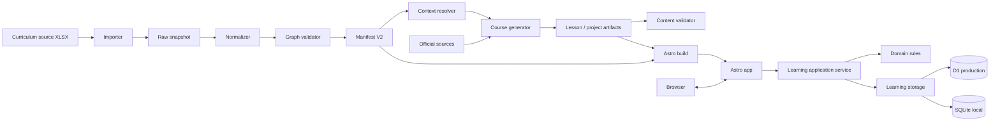

# CS-101 — Engineering design

Updated · 7 Oktober 2026 · Mengikuti [product design](design.md)

CS-101 memakai **hierarchical curriculum + dependency graph + runtime learning state**. Curriculum adalah build-time/source data; progress dan evidence adalah runtime data. Production berjalan di Astro Cloudflare Workers + D1, sedangkan local development tetap dapat memakai Astro Node + SQLite.

Target arsitektur bukan LMS generik dan bukan graph platform. Curriculum saat ini sekitar ratusan item, sehingga struktur data sederhana, deterministic, dan tervalidasi lebih penting daripada infrastructure berat.

## System model



Ada dua lifecycle yang sengaja dipisahkan:

1. **Curriculum/content lifecycle**: import → normalize → validate → generate → build.
2. **Learning lifecycle**: browse → active item → session/evidence → completion → review.

Request browser tidak membaca spreadsheet, menjalankan generator, atau mengubah curriculum.

## Source of truth

| Data | Source of truth | Runtime |
| --- | --- | --- |
| Track/module/item structure | Curriculum source snapshot | Manifest V2 |
| Scope, challenge, criteria, project requirements | Curriculum source snapshot | Manifest V2 |
| Relations/prerequisites | Manifest V2 hasil normalisasi | In-memory graph indexes |
| Lesson content | MDX + generation metadata | Astro content |
| Active item/progress/review | Learning storage | D1 / SQLite |
| Evidence/session history | Learning storage | D1 / SQLite |
| Theme/draft input | Browser | localStorage/memory |

Curriculum source tidak dibaca dari D1. D1 menyimpan state learner, bukan curriculum authoring data.

## Curriculum Manifest V2

Flat `tasks[]` diganti menjadi model eksplisit.

```ts
type CurriculumManifestV2 = {
  version: 2;
  tracks: Track[];
  modules: Module[];
  items: CurriculumItem[];
  relations: Relation[];
};

type Track = {
  id: string;
  title: string;
  order: number;
};

type Module = {
  id: string;
  trackId: string;
  title: string;
  order: number;
  sourceLabel?: string;
};

type CurriculumItem =
  | LearningUnit
  | ProjectCheckpoint
  | IntegrationExercise;
```

### Learning unit

```ts
type LearningUnit = {
  id: ItemId;
  kind: "unit";
  trackId: string;
  moduleId: string;
  order: number;

  title: string;
  scope: string[];
  criteria: Criterion[];
  challenge: Challenge;

  prerequisites: ItemId[];
  source: SourceRef;
  estimatedMinutes?: number;

  fingerprint: string;
};
```

### Project checkpoint

```ts
type ProjectCheckpoint = {
  id: ItemId;
  kind: "checkpoint";
  trackId: string;
  moduleId: string;
  order: number;

  title: string;
  problemStatement: string;
  requirements: Criterion[];

  prerequisites: ItemId[];
  parentProjectId?: ItemId;

  source?: SourceRef;
  fingerprint: string;
};
```

### Integration exercise

```ts
type IntegrationExercise = {
  id: ItemId;
  kind: "integration";
  title: string;
  order: number;

  prerequisites: ItemId[];
  criteria: Criterion[];
  brief: string;

  fingerprint: string;
};
```

Integration tidak harus mempunyai satu `trackId` karena sifatnya lintas-track.

### Relation

```ts
type Relation = {
  from: ItemId;
  to: ItemId;
  type:
    | "prerequisite"
    | "foundation"
    | "related"
    | "deep_dive"
    | "contributes_to"
    | "project_parent";
};
```

Hanya `prerequisite` yang memblokir availability secara default. `project_parent` membentuk lineage. Relation lain adalah konteks/navigasi.

## Identifier rules

ID curriculum harus stable dan deterministic.

- Existing IDs seperti `JAV-001`, `SQL-P06`, `INT-001` dipertahankan.
- Module mendapat slug ID stabil seperti `java-core`, bukan hanya phase number.
- Phase/source label disimpan sebagai metadata bila perlu.
- Jangan memakai numeric phase sebagai identity; source dapat mempunyai label/nomor phase yang tidak unik.
- Criterion ID deterministic dan termasuk dalam fingerprint item.
- Perubahan presentation order tidak boleh mengubah ID.

## Curriculum import pipeline

```text
kurikulum.xlsx
   ↓
extract rows
   ↓
raw snapshot
   ↓
normalize
   ├─ track
   ├─ module
   ├─ unit
   ├─ checkpoint
   ├─ integration
   └─ relation
   ↓
validate
   ↓
manifest.v2.json
```

Importer harus deterministic. Input yang sama menghasilkan manifest byte-equivalent setelah canonical ordering.

### Normalization

Normalizer:

- memetakan sheet/jalur ke `Track`;
- memetakan phase/group source ke `Module` stabil;
- mengklasifikasikan `Jenis` menjadi unit/checkpoint/integration;
- memecah prerequisite menjadi ID eksplisit;
- mempertahankan scope/challenge/criteria/problem statement/requirements asli;
- memetakan cross-module reference ke typed relation jika format dikenali;
- menyimpan relation yang tidak dapat dipastikan sebagai validation issue, bukan menebak prerequisite;
- mengubah estimasi ke menit bila format dapat diparse tanpa ambiguity.

Jangan melakukan AI semantic deduplication pada requirement saat import.

## Validation

Build gagal jika invariant curriculum rusak.

Validator minimum:

- duplicate track/module/item ID;
- item menunjuk track/module yang tidak ada;
- missing hard prerequisite;
- cycle di hard-prerequisite graph;
- invalid project parent;
- cycle di project lineage;
- checkpoint parent berada pada lineage yang tidak konsisten;
- duplicate criterion ID dalam item;
- reserved/invalid criterion ID;
- relation target tidak ada;
- module/item order collision yang membuat output non-deterministic;
- integration tanpa prerequisite/criteria yang valid;
- stale lesson metadata terhadap fingerprint aktif.

Hard prerequisite cycle dicek dengan DFS/Kahn O(V+E). Dengan ratusan item, tidak perlu graph database.

## Graph indexes

Setelah manifest valid, bangun index read-only:

```ts
type CurriculumGraph = {
  tracksById: Map<TrackId, Track>;
  modulesById: Map<ModuleId, Module>;
  itemsById: Map<ItemId, CurriculumItem>;

  moduleItems: Map<ModuleId, ItemId[]>;
  prerequisites: Map<ItemId, ItemId[]>;
  dependents: Map<ItemId, ItemId[]>;

  relationsFrom: Map<ItemId, Relation[]>;
  relationsTo: Map<ItemId, Relation[]>;

  projectChildren: Map<ItemId, ItemId[]>;
};
```

Graph dibangun satu kali dari manifest, bukan query berulang ke database runtime.

## Availability dan state

Jangan menyimpan semua state sebagai satu enum.

### Availability

Derived dari graph + completion:

```ts
isReady(itemId) =
  prerequisites(itemId).every(id => completion(id) === "passed")
```

Nilai:

- `locked`
- `ready`

Availability tidak perlu persisted sebagai source of truth.

### Completion

Persisted:

- `not_started`
- `active`
- `passed`
- `stale`

`stale` berarti curriculum fingerprint aktif berbeda dari fingerprint yang digunakan saat passed.

### Review

Persisted/derived dari schedule:

- `none`
- `scheduled`
- `due`
- `retry`
- `retained`

Review tidak mengubah historical completion evidence.

## Cumulative project lineage

Checkpoint menggunakan `parentProjectId`.

```text
JAV-P01
  ↓
JAV-P02
  ↓
JAV-P03
```

Untuk presentation, hitung:

```ts
inheritedRequirements(project)
newRequirements(project)
```

Source requirement tetap utuh.

Untuk deterministic delta awal, gunakan normalized exact text/stable requirement fingerprint. Jangan menghapus requirement hanya karena semantic similarity.

Jika source checkpoint secara eksplisit menyatakan "includes every requirement from Project N", importer boleh membentuk lineage, tetapi tetap simpan source text asli.

## Content artifacts

Jenis item mempunyai artifact berbeda:

| Item kind | Artifact |
| --- | --- |
| unit | MDX lesson |
| checkpoint | Project spec/workspace metadata + optional MDX explanation |
| integration | Integration brief/workspace metadata |
| review | Runtime assessment instance |

Jangan memaksa checkpoint menjadi lesson MDX biasa.

## Generator context resolver

Generator tidak menerima seluruh curriculum.

Untuk satu unit, context resolver menyiapkan packet:

```text
current item
direct prerequisites
current module
nearest checkpoint
project lineage context
selected related/deep-dive items
source refs
```

Pemilihan context deterministic dari graph. Model tidak memilih dependency sendiri.

Generation flow:

1. Resolve item + context.
2. Fetch/review official sources.
3. Generate staged artifact + metadata.
4. Validate coverage terhadap criteria/challenge.
5. Validate internal references dan MDX imports.
6. Build artifact.
7. Promote atomically ke release.

Perubahan fingerprint membuat artifact lama stale, tetapi tidak menghapus historical evidence.

## Learning application service

Saat ini business behavior tersebar pada implementasi SQLite dan D1. Target:

```text
HTTP/API
   ↓
LearningApplicationService
   ↓
shared domain rules
   ↓
LearningStorage
   ├─ SQLiteStorage
   └─ D1Storage
```

Jangan membuat repository abstraction per tabel. Ekstrak kontrak yang benar-benar dibutuhkan use-case.

Domain rules yang harus shared:

- validasi active item;
- hard prerequisite / ready check;
- evidence terhadap criterion;
- completion transition;
- stale fingerprint behavior;
- review rules;
- project/integration completion rules;
- idempotency semantics;
- revision conflict semantics.

Transaction implementation boleh berbeda antara SQLite dan D1.

## Runtime data model

Target schema mengganti nama task-specific menjadi item-generic.

### learner_state

```text
id
active_item_id
revision
```

### item_progress

```text
item_id PK
completion_status
passed_fingerprint
last_anchor
continue_from
started_at?
passed_at?
```

Availability tidak disimpan.

### sessions

Append-only:

```text
id
item_id
recorded_at
kind
fingerprint
continue_from
minutes?
payload
```

### evidence

```text
id
item_id
kind
value
recorded_at
fingerprint
session_id?
```

### criterion_evidence

Many-to-many:

```text
evidence_id
item_id
criterion_id
criterion_fingerprint
```

Satu evidence dapat mendukung beberapa criteria; mapping harus eksplisit.

### review_attempts

```text
id
item_id
question_set_version
answers
grading_mode
score
assisted
result
recorded_at
```

### review_schedule

```text
item_id
policy_version
step
due_at?
state
```

Policy v1: interval 1 → 3 → 7 → 14 → 30 hari. Interval ini adalah policy aplikasi dan tidak berasal dari curriculum workbook. `due` diturunkan dari `scheduled + due_at <= now`; `retry` dan `retained` disimpan eksplisit.

### request_receipts

```text
request_id
payload_hash
response
nonce / implementation metadata
```

Digunakan untuk retry-safe mutation.

## Completion invariant

Unit passed hanya jika:

- semua required criteria mempunyai evidence;
- challenge requirement yang diwajibkan terpenuhi;
- fingerprint cocok dengan curriculum aktif;
- assessment rule yang dipakai product terpenuhi.

Checkpoint passed hanya jika seluruh active project requirements evidenced.

Integration passed hanya jika seluruh integration criteria evidenced.

Server menghitung status. Browser tidak boleh mengirim arbitrary `status=passed`.

Waktu belajar, scroll position, membuka solution, dan keberadaan lesson tidak dapat meluluskan item.

## API target

| Endpoint | Kontrak |
| --- | --- |
| `GET /api/learning` | active item, continuation, completion/review state, revision |
| `GET /api/curriculum/state` | optional compact derived availability/completion map |
| `POST /api/active-item` | ganti active item; cek readiness; simpan draft previous session secara atomik |
| `POST /api/sessions` | append session/progress |
| `POST /api/evidence` | simpan evidence + criterion mapping |
| `POST /api/complete` | validasi DoD lalu transition ke passed |
| `POST /api/reviews` | simpan attempt + schedule |
| `GET /api/export` | export learning state + evidence/session history |

Endpoint dapat digabung pada tahap awal selama domain contract tetap jelas.

Semua mutation membawa:

- `requestId`
- expected `revision`

Retry identik mengembalikan receipt lama. Payload berbeda dengan request ID sama → 409. Revision conflict → 409. Invalid domain input → 422. Storage unavailable → 503.

## Local dan production storage

### Production

- Astro Cloudflare adapter.
- Cloudflare Worker.
- D1 binding `LEARNING_DB`.
- Static assets dari Astro build.
- Curriculum manifest dan content ikut release artifact.
- D1 hanya learning state.

### Local

- Astro Node config.
- SQLite file.
- Schema/domain behavior sama.
- Storage-specific transaction implementation berbeda.

Tidak ada fallback diam-diam dari production D1 ke local SQLite. Jika production binding tidak tersedia, fail fast dengan error yang dapat didiagnosis.

## Transaction semantics

Mutation learning harus atomic pada boundary use-case.

Contoh complete item:

```text
check receipt
check revision
load current progress
validate curriculum fingerprint
validate prerequisite/completion rules
validate evidence coverage
write progress transition
write session/event if needed
write receipt
commit
```

SQLite dapat memakai `BEGIN IMMEDIATE`. D1 menggunakan batch/conditional writes sesuai kemampuan adapter. Domain outcome harus setara.

## Search

Manifest dapat membangun search index lokal:

```ts
{
  itemId,
  title,
  trackTitle,
  moduleTitle,
  scopeKeywords
}
```

Search dilakukan client-side atau server-side dari artifact kecil. Tidak perlu Algolia/Elasticsearch untuk ukuran curriculum ini.

## UI view models

React/Astro component tidak membaca graph raw.

Bangun selector/view-model layer:

```ts
getTrackExplorer(trackId)
getItemHeader(itemId)
getItemConnections(itemId)
getProjectDelta(projectId)
getTodayView()
getProgressOverview()
```

Contoh:

```ts
type ModuleView = {
  id: string;
  title: string;
  completed: number;
  total: number;
  items: ItemRowView[];
};
```

Ini menjaga UI dari business logic dependency.

## Migration dari V1

Current V1:

```text
Task
track
phase
order
prerequisites
criteria
challenge
projectRequirements
```

Target V2:

```text
Track
Module
CurriculumItem
  ├─ Unit
  ├─ Checkpoint
  └─ Integration
Relation[]
```

Migration dilakukan bertahap:

1. Tambah schema V2 dan importer tanpa menghapus V1.
2. Generate `manifest.v2.json` dari curriculum source.
3. Tambah adapter/selectors sehingga UI baru membaca V2.
4. Ubah `task_progress` → `item_progress` melalui migration storage yang menjaga historical rows.
5. Ubah `active_task_id` → `active_item_id`.
6. Pisahkan project requirements dari unit.
7. Tambah evidence tables dan backfill evidence dari session payload bila aman.
8. Setelah test migration/export lulus, hapus compatibility V1.

Historical Task ID tetap valid karena unit ID existing dipertahankan.

## Repository target

```text
cs-101/
├── curriculum/
│   ├── raw/
│   ├── manifest.v2.json
│   └── import-report.json
├── generation/
│   └── <ITEM-ID>.json
├── scripts/
│   ├── import-curriculum.ts
│   ├── validate-curriculum.ts
│   └── validate-content.ts
├── src/
│   ├── content/lessons/
│   ├── domain/
│   │   ├── curriculum/
│   │   │   ├── schema.ts
│   │   │   ├── graph.ts
│   │   │   ├── selectors.ts
│   │   │   └── fingerprint.ts
│   │   └── learning/
│   │       ├── rules.ts
│   │       └── schema.ts
│   ├── server/
│   │   ├── learning-service.ts
│   │   └── storage/
│   │       ├── d1.ts
│   │       └── sqlite.ts
│   ├── components/
│   │   ├── curriculum/
│   │   └── course/
│   ├── layouts/
│   └── pages/
├── migrations/
└── tests/
```

Struktur boleh disederhanakan selama boundaries tetap sama.

## Test strategy

### Curriculum

- parser fixture untuk setiap track/item kind;
- deterministic manifest snapshot;
- missing prerequisite;
- duplicate ID;
- prerequisite cycle;
- broken project lineage;
- unresolved relation;
- module ordering;
- exact requirement delta.

### Domain learning

- locked item tidak dapat dijadikan active melalui protected transition;
- ready setelah semua prerequisite passed;
- passed but stale setelah fingerprint berubah;
- evidence missing ditolak;
- satu evidence mendukung beberapa criteria;
- project/integration completion;
- review assisted tidak dianggap passed;
- request retry idempotent;
- revision conflict.

### Storage contract

Jalankan behavior suite yang sama terhadap SQLite dan D1 adapter sejauh environment memungkinkan.

### UI

- explorer tidak expand semua track;
- active module/item terlihat;
- project menunjukkan new vs inherited requirements;
- integration menunjukkan missing prerequisite;
- search membuka item benar;
- Today menampilkan active/next-ready yang benar;
- accessibility keyboard/focus/reflow.

## Deployment

Production build:

```text
pnpm run build
  ↓
validate curriculum/content
  ↓
apply required D1 migration in deployment workflow
  ↓
Astro Cloudflare build

npx wrangler deploy
  ↓
Worker + static assets
```

Deployment command tetap `npx wrangler deploy` pada Cloudflare. Preparation berada pada build workflow sesuai repository contract saat ini.

Database migration harus idempotent dan dijalankan sebelum release yang membutuhkan schema baru. Jangan deploy code yang membaca kolom/table baru sebelum migration tersedia.

## Observability

Catat metadata operasional, bukan isi evidence pribadi:

- request ID;
- route/use-case;
- item ID;
- storage adapter;
- duration;
- error category;
- revision conflict;
- curriculum fingerprint mismatch.

Untuk production failure, log harus membedakan:

```text
curriculum validation
content/build
missing binding
D1/schema
domain validation
revision conflict
runtime render
```

## Implementation roadmap

| Phase | Outcome | Definition of done |
| --- | --- | --- |
| P0 Curriculum V2 | Importer, Track/Module/Item, relation graph | Workbook menjadi manifest deterministic; invalid graph gagal build |
| P1 Explorer | Icon rail + contextual curriculum explorer | Ratusan item tetap navigable tanpa flat sidebar |
| P2 Generic learning state | item_progress, active item, readiness | Unit/checkpoint/integration memakai state engine sama |
| P3 Project workflow | lineage + requirement delta + project evidence | Cumulative checkpoint dapat dikerjakan tanpa duplicate wall-of-text |
| P4 Cross-module graph | typed relations + Connections selector/UI | Related/deep-dive terlihat tanpa menjadi prerequisite |
| P5 Review engine ✅ | attempts + schedule + retention | Review due/retry/retained konsisten |
| P6 Generator context | graph-aware context packet | Generator menerima prerequisite/project context yang tepat |
| P7 Progress + search | hierarchical progress + local search | User dapat menemukan dan memahami posisi di curriculum besar |

## Engineering acceptance

- [ ] Manifest V2 mempertahankan scope, challenge, exit criteria, problem statement, project requirements, dan source dari curriculum.
- [ ] Track/module/item ID deterministic.
- [ ] Hard-prerequisite graph bebas cycle dan missing node.
- [ ] Project lineage valid dan requirement delta deterministic.
- [ ] Related/deep-dive tidak memblokir readiness.
- [ ] Availability derived, bukan persisted source of truth.
- [ ] Completion tidak berasal dari waktu/scroll/content existence.
- [ ] Unit/checkpoint/integration memakai shared learning rules.
- [ ] SQLite dan D1 memberi domain outcome yang sama untuk mutation contract.
- [ ] Historical evidence tetap dapat dibaca setelah curriculum fingerprint berubah.
- [ ] Retry tidak menggandakan session/evidence.
- [ ] Revision conflict tidak menimpa perubahan tab lain.
- [ ] Curriculum source tidak dibaca per-request di production.
- [ ] UI tidak mengandung dependency business logic.
- [ ] Build/deploy gagal secara diagnostik jika manifest, migration, atau D1 binding invalid.

## Keputusan eksplisit

- Tidak memakai graph database.
- Tidak memakai search service eksternal.
- Tidak membaca XLSX saat request runtime.
- Tidak menjadikan semua cross-module reference sebagai prerequisite.
- Tidak menjadikan project sebagai unit lesson biasa.
- Tidak mengganti historical ID ketika berpindah ke Manifest V2.
- Tidak menambah multi-user/auth model sampai kebutuhan itu menjadi scope produk.
